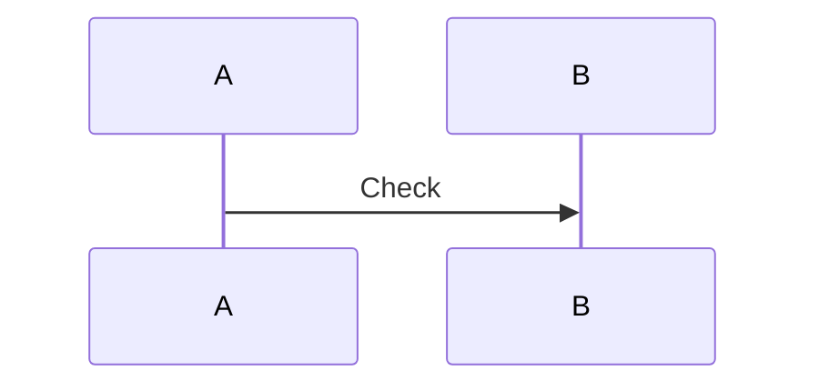

<!-- qore-spec/1 -->
~~~~gherkin
Feature: Probe
  Scenario: AC01 Test
    Given input
    When executed
    Then output
      """
      literal
~~~~
Coverage: AC01 -> US1

```mermaid
sequenceDiagram
 A->>B: Check
```
