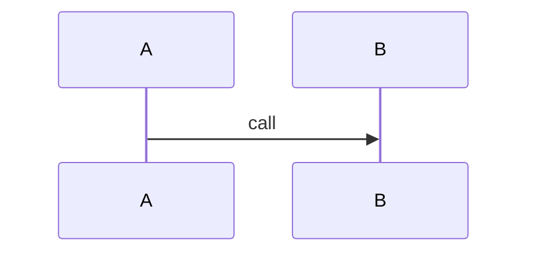

<!-- qore-spec/1 -->
```gherkin
Feature: Preserve inputs
  Scenario Outline: A01 Has no Examples
    Given <input>
    When it runs
    Then <output>
```
Coverage: A01 -> US1 / D1

```mermaid
sequenceDiagram
  A->>B: call
```
