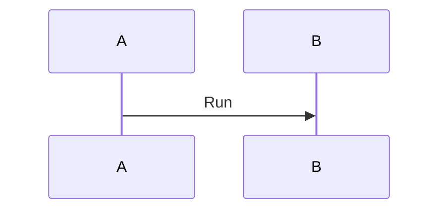

<!-- qore-spec/1 -->
```gherkin
Feature: Probe
  Scenario Outline: AC01 Literal argument
    Given a <message>
    When run
    Then done
```
Coverage: AC01 -> US1

```mermaid
sequenceDiagram
  A->>B: Run
```
